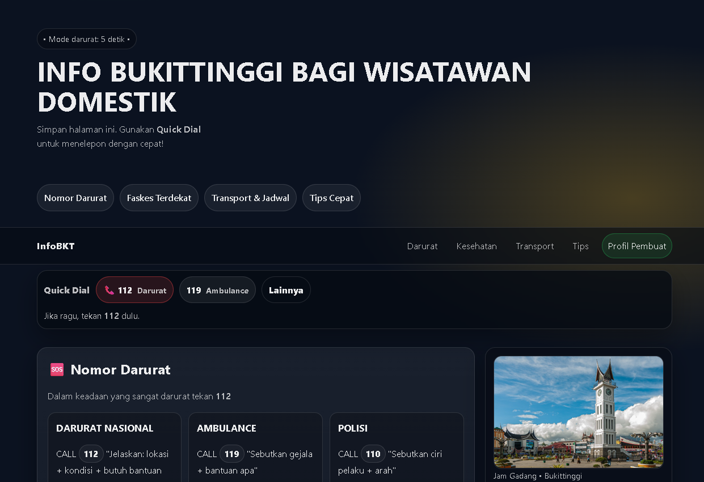

# Info Bukittinggi — Direktori Darurat & Transport (Single Page)

> Proyek latihan front-end (HTML + CSS) sebagai bagian dari progres belajar coding melalui sertifikasi Belajar Dasar Pemrograman Web di **Dicoding Indonesia**.  
> Fokus: **semantic HTML**, **Flexbox layout**, **responsif**, dan **aksesibilitas dasar**.

## 🌟 Tentang Proyek
**Info Bukittinggi** adalah halaman satu-lembar (single page) untuk membantu wisatawan domestik mendapatkan info cepat:
- **Quick Dial** nomor darurat (tel:112 / 119 / 110 / 113)
- **Fasilitas kesehatan** terdekat + tautan Google Maps
- **Transportasi & jadwal** sebagai acuan awal
- **Tips cepat** untuk kondisi darurat & perjalanan

> Catatan: data bisa berubah. Tetap konfirmasi ke sumber resmi/operator setempat.

## ✨ Fitur Utama
- ✅ **Quick Dial bar** (sticky) untuk akses cepat nomor darurat
- ✅ Navigasi anchor yang jelas (Darurat / Kesehatan / Transport / Tips)
- ✅ Layout **Flexbox** (tanpa framework)
- ✅ Responsif:
  - Layout kolom → stack di layar kecil
  - Mode perangkat sentuh: Quick Dial menjadi fixed di bawah layar
- ✅ Aksesibilitas dasar:
  - Skip link “Lewati ke konten utama”
  - `aria-label` di elemen interaktif
  - Gambar punya `alt`
  - Dukungan `prefers-reduced-motion`

## 🧰 Tech Stack
- **HTML5** (semantic tags: `header`, `nav`, `main`, `article`, `aside`, `footer`)
- **CSS3** (Flexbox, media query)
- Tanpa library layout (Bootstrap/Tailwind/dll)

## 📁 Struktur Folder
info-bukittinggi/
├─ index.html
├─ styles/
│ └─ styles.css
├─ assets/
│ └─ jam-gadang.jpg
└─ LICENSE

## 🚀 Cara Menjalankan (Local)
### Opsi 1 — Langsung buka file
1. Clone repo ini
2. Buka `index.html` di browser

### Opsi 2 — Pakai Live Server (disarankan)
Jika Anda pakai VS Code:
1. Install extension **Live Server**
2. Klik kanan `index.html` → **Open with Live Server**

## ✅ Checklist Kriteria Submission Dicoding (yang dipenuhi)
- [x] Menggunakan semantic tags: `header`, `nav`, `main`, `article`, `aside`, `footer`
- [x] `nav` berisi link menuju **profil Dicoding pembuat**
- [x] `aside` menampilkan gambar (foto diri / relevan dengan konten)
- [x] Layout dibuat dengan **Flexbox**, bukan float
- [x] Hanya ada **1** file `index.html`

> ⚠️ Pastikan Anda mengganti link profil Dicoding di navbar agar sesuai akun Anda:
`https://www.dicoding.com/users/<username>`

## 🧹 Catatan Perapihan (biar makin profesional)
Beberapa hal kecil yang bisa Anda rapikan agar markup lebih “clean”:
- Periksa validitas HTML (hindari tag penutup ganda seperti `
` ekstra).
- Periksa validitas CSS (hindari kurung kurawal `}` yang berlebih).
- Tambahkan screenshot ke `docs/preview.png` untuk tampilan README yang lebih meyakinkan.

## 🗺️ Roadmap (Ide Pengembangan Lanjutan)
- [ ] Jadikan PWA (offline + add to home screen)
- [ ] Data sumber terpisah (JSON) agar mudah update
- [ ] Tambah “Simpan kontak darurat” (vCard) / tombol salin
- [ ] Multi-bahasa (ID/EN)

## 👤 Author
- Nama: **EB Willem**
- Dicoding: https://www.dicoding.com/users/ebwillem/academies
- GitHub: https://github.com/engelwillem/info-bukittinggi.git
- Link Deploy: https://engelwillem.github.io/info-bukittinggi/

## 📄 Lisensi
Project ini menggunakan lisensi **MIT** — lihat berkas [LICENSE](LICENSE).
